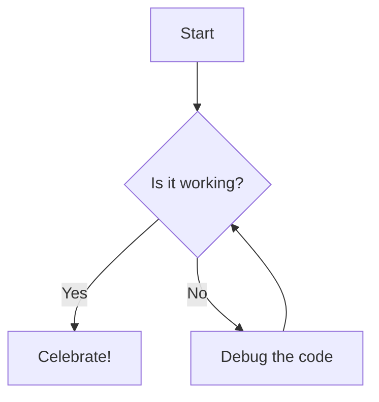

This is the testing post. Real content comming soon!

```python
import pandas as pd 
import datetime

df = pd.DataFrame({
    'name': ['Alice', 'Bob', 'Charlie'],
    'age': [25, 30, 35],
    'join_date': [datetime.date(2020, 1, 15), datetime.date(2019, 5, 20), datetime.date(2021, 3, 10)]
})

df['join_date'] = pd.to_datetime(df['join_date'])

print("Hello World")
```


```sql 
select name, age, join_date
from users
where age > 30
```

```malloy
model: users {
  dimension: name {
    type: string
  }
  dimension: age {
    type: number
  }
  dimension: join_date {
    type: date
  }
}
```




> Testing Quote

# Heading 1
## Heading 2
### Heading 3
- Bullet point 1
- Bullet point 2
1. Numbered item 1
2. Numbered item 2

<Alert status=info>
    What is this, can I use evidence syntax here? 
</Alert>


```sql query_name
query
```

> Kìa màn đêm hiu hắt
>
> -- _Thái Vũ_
